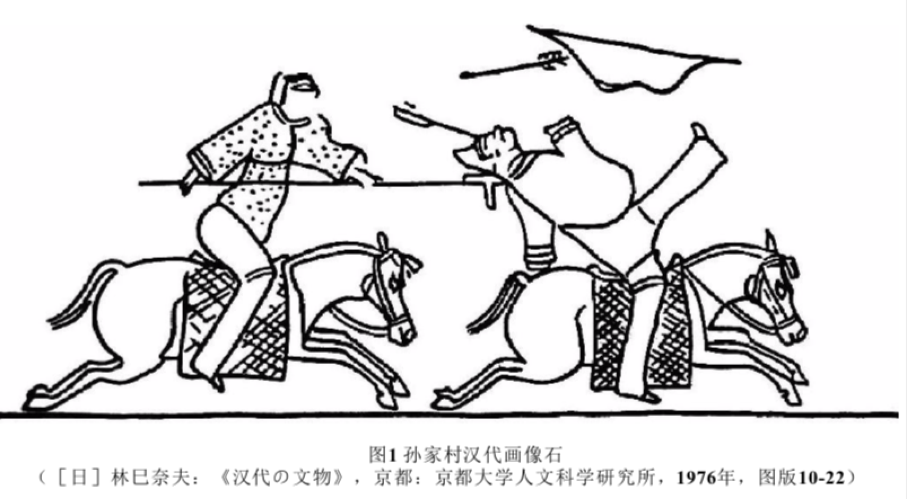

export { book as theme } from '@mdx-deck/themes'
import {
  Split,
} from '@mdx-deck/layouts'

## 《南北战争三百年》 by 李硕

---

> 聚焦的时代,是秦统一后,分裂割据最严重的魏晋南北朝时期.作者不是叙述战争的故事,而是试图探讨胡汉种族差异、南北地域差异这样两个特殊背景下,所进行的战争中的某些问题,而这些问题恰恰是从司马迁到司马光等史学家都比较忽视的.

---

## 兵种及其装备

#### 早期的兵种战术特征

---

- 骑兵

> “儿能骑羊,引弓射鸟、鼠;少长,则射狐、兔:用为食.士力能弯弓,尽为甲骑.” --《史记匈奴列传》

> 内陆亚洲游牧国家以帝国联盟的方式组织起来,它们在对外事务上是像国家那样独裁的,但内部组织则是协商和联盟化的.

> 领袖对部署权威和控制力远不如汉地,当部署对领袖失去信任时,很容易带着畜群远走他乡.

---

> 本书认为,这种骑射游击战术与游牧松散的权力结构有直接关系：匈奴人骑射作战“利则进,不利则退,不羞遁走”“见利则逐利,如鸟之集；其困败,则瓦解云散”,参战动机是为了劫掠财物致富,来自单于的赏赐不过是象征性的一杯酒而已,首领对下属战士没有绝对权威,无法强制他们参与危险的军事行动,所以匈奴人从不与敌军进行硬碰硬的正面作战,也不会采用危险的肉搏冲击战术。从战国到汉代前期,游牧族从未与中原主力军队进行过大规模决战,也从未进行对城池堡垒的大规模攻坚战.

---

> 反观中原,自春秋末年以来,步兵开始成为战场主力兵种,严格的纪律一直是步兵作战的基本原则,战术则是列成密集的队形,与敌军进行面对面的砍杀肉搏。孙武为吴王训练宫女“吴宫教战”“三令五申”的故事,就是最早的典型例证。战国初期,中原列国通过变法运动,都确立了这种中央集权政治下的军事模式,军队是由国家财政供养的军事机器,战争行为是为了贯彻统治者的意志,军事统帅对士兵拥有绝对权威,可以命令士兵们投入哪怕是必死的肉搏作战。两相对照可以发现,匈奴等游牧族骑射、游击的战术形式,与其生活方式和社会权力结构有直接关系。

---

汉人骑兵

> 自赵武灵王的胡服骑射改革后, 中原政权开始组建骑兵. 骑兵和春秋时的战车一样可以告诉奔驰, 对地形适应高于战车. 但当时无马镫,无法正面冲击, 只能用弓箭射击.

> 「车者,军之羽翼也,所以陷坚陈,要强敌,遮走北也;骑者,军之伺候也,所以踵摆军,绝粮道,击便寇也.」

- 侦查、骚扰、绝粮道
- “薄”“翼”, 不正面冲锋
- 威慑敌军

---

七国之乱刘濞围攻梁城

> 周亚夫命坚壁不出,`使轻骑兵绝吴楚兵后食道,吴兵乏粮...吴兵既饿,乃引而去。太尉出精兵追击,大破之。`

---

#### 汉匈战争

白登之围

> 韩王信叛汉投降匈奴...匈奴败走, 刘邦率车骑兵追至平城,却被匈奴围在白登山七天,但匈奴没有贸然进攻,最后以外交手段罢兵.

> 此一战,匈奴的不可预知性和超强的机动性给汉军带来全新的观念冲击: 敌人一旦退却就难以琢磨; 汉军追击搜寻之际, 敌军主力突然实施合围.

> 对匈奴而言, 汉军也是全新的、棘手的敌人: 匈奴骑兵无法强攻阵地战的步兵, 外加很可能已经侦测到赶来的汉军援军.

---

> 匈奴春夏畜牧, 秋冬狩猎, 伺机侵扰汉地边界.汉初经济凋敝,实行休养生息,根据匈奴季节性进攻的特点进行被动防守,外加和亲等外交手段.汉武帝时期,开始主动出击匈奴.

1. 季节性打击致使匈奴避难,大量母畜堕胎.
2. 春季战马偏瘦,农业社会的汉地用存粮来补足战马体力.
3. 卫青、霍去病在战术上进行创新, 骑兵从骑射到冲击.

---

---

李广、李陵

> 李广对匈战争基本没有什么战功. 他过于重视自己对骑射技艺,忽略了大部分将士骑射不如匈奴人的弊端

- 善骑射
- 治军不严
- 个人英雄主义

---

李陵战败被俘

> 李陵五千步卒孤军深入, 与单于主力数万人激战, 且战且退, 至距汉塞百余里处兵败, 全军覆没.

> 但在此处战斗中, 能反应出匈奴人并不善于与汉军步兵正面交战.李陵五千步兵弓箭手,以辎重车为掩护.单于十万大军围攻不下.李陵军苦战多日, 箭尽粮绝, 但也杀敌万余.

> 此时的游牧族权力组织分散, 无法管理农业地区. 军队宁愿掠夺中原,也不愿正面征服中原.

---

#### 骑兵冲击的发展

> 刘秀时期出现突骑,但此时对阵步兵仍有相当的难度和危险。一般在军队队列松动,才从侧翼或后方进攻。此时尚未有马镫,骑兵冲击时,用戟冲刺敌军,容易使自身落马。

---

汉末开启了马背上的英雄时代

- 长矛作为进攻武器
- 马铠重新回到战场(铁马)

> 但是三国后期,对骑兵的运用能力都有所衰退,魏晋趋于保守,吴、蜀缺少战马和骑兵人才.

---

#### 骑兵的成熟与游牧族的崛起

> 西晋八王之乱,鲜卑、乌桓骑兵被大量征用。游牧族也掌握了中原骑兵的冲击战术,并再后来以摧枯拉朽的态势击败中原骑兵步兵。
> 游牧族（匈奴刘渊、羯胡石勒、鲜卑族拓跋氏）汉化,学习中原的集权政治系统,开始了对中原政权对军事优势。

- 装备的演进, 出现了马镫、马槊（4米的长矛)
- 配合骑射、下马作战,骑兵技术走向成熟,骑兵技艺,战术形态展现出灵活性和多样性。
- 骑兵冲击力从战术上能冲散步兵方阵, 对步兵杀伤力很大(兰陵王率五百骑兵两次冲入北周大军,被后人留下《兰陵王入阵曲》)

> 东魏西魏,北齐北周时期骑兵战争之激烈,战术之丰富,远超魏晋南北朝其他政权, 经过这一代人才走向了隋唐的一统。

---

#### 步兵

- 陷阵, 打开敌军缺口.东汉末年后, 骑兵开始承担陷阵的任务.
- 以旗鼓为令指挥士兵行、驻、前、后、左、右
- 信息不畅导致的军阵异动

应对骑兵

- 以辎重车为掩体
- 枪矛斜插在地上防御突袭
- 斫营. 骑兵部队劳动力有限,少营垒,且难以临时装备马匹.

---

#### 重大战役的战略问题(东吴时期南北对峙)

曹操、曹丕渡江尝试
> 曹操赤壁战败

曹丕 --“嗟乎,固天所以隔南北也”
- 224年,造船由运河行至广陵(扬州), 入江遇风浪倾覆.
- 次年十月枯水期, 准备渡江,但魏军船只冻在运河上无法驶入长江.

东吴江防
> 东吴少马,无法进入淮河流域的平原和北方军队对抗.但依托长江和北方进入了长期但拉锯战.

---

西晋灭吴

- 司马炎得国不正,疑心重,多任用皇亲国戚.
- 羊祜经营荆州、支持王𣿰于益州造船
- 贾充等人试图垄断朝堂不愿看到羊祜等人建功立业,因此反对伐吴.

最终司马炎听从张华、杜预主战派决议伐吴,王𣿰益州八年造船,顺江而下,取建业.

---

## 南北朝的战争与政权

#### 北魏第一阶段

> 拓跋圭到拓跋焘时期北魏政权保留着草原名族的特点。这一阶段政治形态上从松散的部落联盟转为君主集权, 并且经历了骑兵从骑射到冲击的转型.但缺乏系统到后勤保障,擅长野战而短于攻城。对东晋南北朝的战线只能维持在黄河一线。

---

#### 第二阶段

> 献文帝拓跋宏时期,开始组建步兵,开始积累大兵团的持久战攻坚战经验。政治上,加强集权程度,深化对汉人的统治,利用中原的财赋、人力等军事资源进行中原传统形式的战争。

---

#### 第三阶段

> 与南方政权在淮河汉水流域作战。这一阶段,北朝政治形态的汉化已经非常彻底。作战上经验更加丰富,在水网、丛林方面以步兵为主,并且在这种地域探索使用骑兵和舟楫水师的经验。学习并掌握了涉渡、架设浮桥、开掘或者修筑堰坝等工作。这一阶段的转型一直持续到了后面的东西魏、北齐北周时期。

---

#### 南朝的财务

> 相比北朝,南朝战争形态上没有太大转变, 但是军事动员体制有一些特色, 即用货币(*铸币)手段筹措军费.

刘宋

- 刘宋元嘉年间, 刘义隆铸四铢钱, 但因缺少区分大小钱的严格标准而被中止.
- 为了北伐, 政府民间举债,结果战事不利,经济凋敝,无法偿还债务.另外战败催生很多难民.于是陷入了财政困难但境地.
- 铸不足值货币、二铢钱

---

梁

> 梁武帝铸铁钱, 禁铜钱, 国家财政状况良好, 对应带来的通货膨胀使得民生凋敝.

陈

> 废除铁钱,改铸四铢钱.后因战事, 又开始铸不足值货币.晚期`又铸六铢钱,以一当五铢之十,与五铢并行`, 通过这种手段,敛财于国库.

> 东晋门阀分权的政权形式使其对社会的动员能力比较有限,而当南朝皇权变得强大之后,迅速开始用铸币、税等財政手段来支持战各活动,政权对社会资源的聚敛程度显著提高.为了维持战争经费开支,南朝政权采用的財政手段有举借国债、铸币贬值和变相增加税等.

---

> 宋元嘉末大量举借国债而无力偿还,加之税减少带来的財政危机,政府只能靠铸币贬值来筹措开支和抵消债务,最终带来币制的彻底崩溃.但南朝的铸币行为与现代社会的发 行纸币又有不同: 1.铜币的重量最终决定其购买力. 2. 政府铸币(哪怕铸造不足值 铜币)的能力有限,而社会上仍流通着大量汉代以来的铜币.新铸不足值铜币的购买力最终 会低于足值铜币,从而形成不同铜币的兑换比例3.南朝的赋税也是征收铜币,当 铜币贬值后,政府的税收也在随之缩水.梁武帝显然认真考察了之前政权铸币、税收的教训,所以他取消了征收钱币的財产税等税种,使税收以实物为主,铸币（铁钱）贬值就不会造成政府税收减少.这样做的最终后果就是使铁钱价值跌落到铁的实际价格附近,商品交易 又回到了实物易货贸易的水平,同时,政府在铸造铁钱和防范盗铸方曲投入了较多成本,而这些成本最终也要转嫁到普通百姓头上.

---

#### 总结

> 通过以上对南朝財政与战争的讨论可见,南方社会经济的商品化、財政的货币化程度都要比北方高,这会带来社会分工的细密化,己经出现了社会经济走向“近代化“的端倪.但另一方面,南方的这些新经济因素并未变成军事实力,政权通过变更钱制、税制筹措军费,使得南方货币体系和整体经济多次遭遇重大动荡,对民生及社会整体也造成了较大破坏.

---

> 作为对比,社会发展程度更低、商品经济与货币更少的北方,军事实力却一直占优势,最后由北方政权攻火南方,实现中国的统一,南方社会也被拖入更为简单、落后的状态。从隋的统一到元的统一,都是在上演这一幕.在商品经济发展,社会走向复杂化的过程中,可能必然经历军事动员能力下降、社会对战争承受能力降低的阶段,如果社会能“挺"过这个阶段,实现初步工业化,就能获得军事优势。但如果在这个阶段被北方简单社会攻灭,则永远没有工业化的可能性。从南朝到明清,中国历史可能一直在这个大循坏中徘徊。

---

# Thank you
